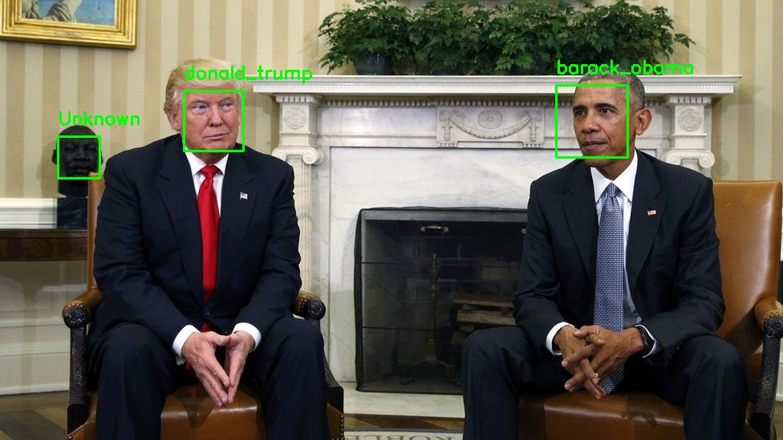

# Face ID

## To install

1. have python version >=3.6
2. pip3 install -r requirements.txt

## To Train

In order to train the image detector you need at least one image per face you want to detect as the training image (the more you have the better), then 
add the image under dataset -> label_for_name -> image.jpg

so the format should look like this

```
dataset
    |-barack_obama
        |- image1.jpg
        |- image2.jps
        ...
    |-joe_biden
        |- image1.jpg
        |- image2.jpg
        ...
```
Then you need to run the training file `encode_dataset.py`

The file has a bunch of commandline arguments that you can pass in to change how things work. For the detection method leave it as the default hog unless you have a CUDA (nvidia) GPU

```bash
usage: encode_dataset.py [-h] -i DATASET -e ENCODINGS [-d DETECTION_METHOD]

options:
  -h, --help            show this help message and exit
  -i DATASET, --dataset DATASET
                        path to input directory of faces + images
  -e ENCODINGS, --encodings ENCODINGS
                        path to serialized db of facial encodings
  -d DETECTION_METHOD, --detection-method DETECTION_METHOD
                        face detection model to use: either `hog` or `cnn`
```

and exmaple run would be the following
```bash
    python3 encode_dataset.py -i dataset -e encodings.pickle
```

This will save the encoded dataset as a .pickle binary file

## To Recognize a face

run either the `recognize_faces_image.py` or the `recognize_faces_video.py`

### Image Recognition

The image recogition file needs an input image that it will test agaist, as well as the pickle file contining the encoded test data. There are also some params that can be used to change some things.

```bash
usage: recognize_faces_image.py [-h] -e ENCODINGS -i IMAGE [-d DETECTION_METHOD] [-s SAVE] [-n NAME]

options:
  -h, --help            show this help message and exit
  -e ENCODINGS, --encodings ENCODINGS
                        path to serialized db of facial encodings
  -i IMAGE, --image IMAGE
                        path to input image
  -d DETECTION_METHOD, --detection-method DETECTION_METHOD
                        face detection model to use: either `hog` or `cnn`
  -s SAVE, --save SAVE  save the result instead of showing it
  -n NAME, --name NAME  The display name of the image
```

an example command is the following

```bash
python3 recognize_faces_image.py -e encodings.pickle -i exmaples/image.jpg
```

example of the result you will get from the recognition



### Video Recognition

The Video recogition uses the webcam as the input it will test agaist, it will aslo need the pickle file contining the encoded test data. There are also some params that can be used to change some things. If you have display turned on, pressing `q` will quit the display

```bash
usage: recognize_faces_video.py [-h] -e ENCODINGS [-o OUTPUT] [-y DISPLAY] [-s SAVE] [-d DETECTION_METHOD]

options:
  -h, --help            show this help message and exit
  -e ENCODINGS, --encodings ENCODINGS
                        path to serialized db of facial encodings
  -o OUTPUT, --output OUTPUT
                        path to output video
  -y DISPLAY, --display DISPLAY
                        whether or not to display output frame to screen
  -s SAVE, --save SAVE  whether or not to the out output frame to a file
  -d DETECTION_METHOD, --detection-method DETECTION_METHOD
                        face detection model to use: either `hog` or `cnn`
```

an example command is the following

```bash
python3 recognize_faces_video.py --encodings encodings.pickle --output output/webcam_face_recognition_output.avi --display 1 
```